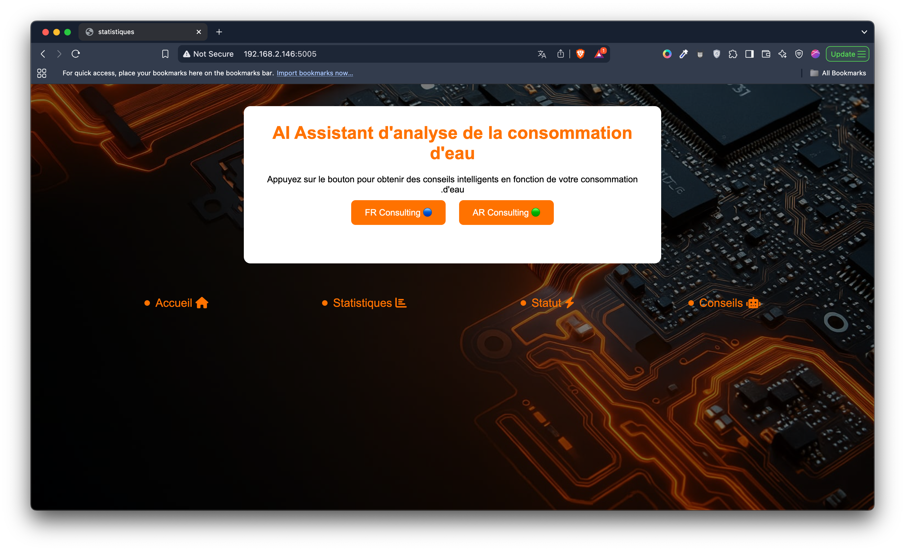
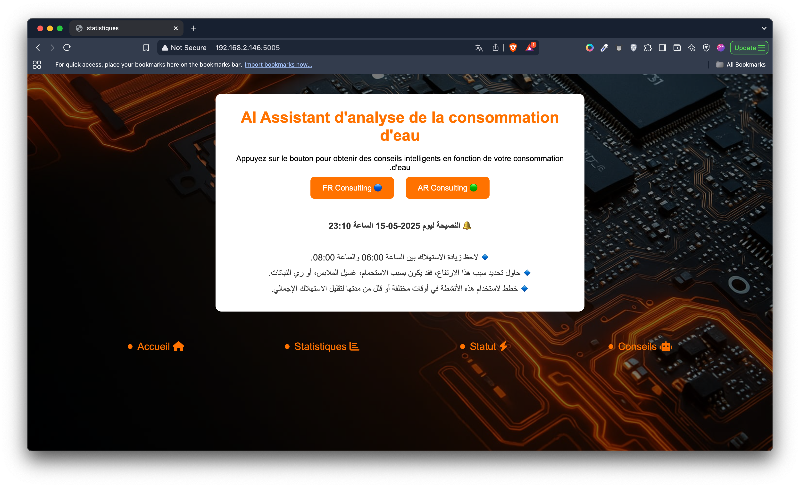
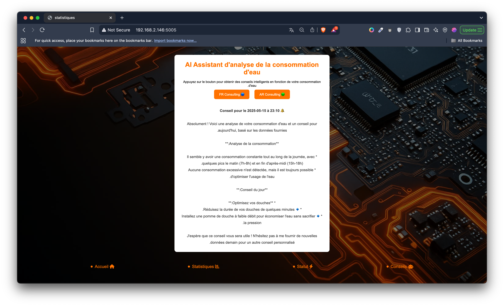

# 💧 IoT Water Tank Monitoring System

This project is a **real-time water tank monitoring system** using Arduino + Python + Flask + Web Visualization. It captures hourly water level data, stores it in JSON format, and syncs to a beautiful dashboard. The system supports smart analysis and visual tracking to help users monitor and manage water usage efficiently.

---

## 🧰 Technologies Used

| Layer         | Technology                    |
|---------------|------------------------------|
| Hardware      | Arduino Uno, Water Level Sensor |
| Communication | Serial over USB              |
| Backend       | Python 3, pySerial, Flask    |
| API Integrity | Gemini API integrity         |
| Frontend      | HTML, CSS, JavaScript        |
| Data Format   | JSON                         |
| Visualization | Chart.js / Custom Graphs     |
| Hosting       | Localhost (can be deployed on cloud) |

---

## 📷 Preview & UI Screenshots

### 🏠 Home Page  


### 🧠 AI Assistance  


### 🌍 Multilingual Support  
- Arabic Version  
    
- French Version  
  

### 📊 Analytics Screens  
- Hourly Analysis  
    
- Weekly Analysis  
  

### 📈 Status Overview  


---

> Watch the full real-time simulation video:  
> **📹 [Video/Real_Sumilation.mp4](Video/Real_Sumilation.mp4)**

---

### 3. 🌐 Flask Web Server

- `app.py` runs a Flask server.  
- Serves HTML templates with real-time data from JSON files using Jinja2 templating.  
- REST endpoints serve water level data for visualization.

---

### 4. 🎨 Web Dashboard

- **HTML Templates:**  
  - `templates/index.html`  
  - `templates/grah.html`  
  - `templates/chat.html`  
  - `templates/statut.html`

- **CSS & JavaScript:**  
  - `static/st.css`  
  - `static/script.js`

- The dashboard updates hourly and displays data in charts and status panels.

---

## 🙌 Special Thanks

We would like to express our deepest gratitude to our team members for their incredible work and collaboration:

- 👨‍💻 **El Mahfoud Oulhadj** — Lead Developer & System Architect & Full Backend
- 🎨 **Imran Chaidmi** — UI/UX Design and Visualization  
- ⚙️ **El Mahfoud Oulhadj && KIND KERRY IZERE** — Arduino & Sensor Integration  
- 🌐 **Omar Morso** — Frontend Dashboard Implementation  

> "Great projects are built by passionate teams. Thank you for the effort, creativity, and persistence!"

---

## 🚀 Future Enhancements

- Real-time updates with WebSockets or MQTT  
- SMS/Email alerts for critical water levels  
- Mobile-friendly UI/UX  
- Cloud integration for historical data analytics  
- AI-based predictions for future water usage  

---

## 🧾 License

This project is licensed under the **MIT License**. Feel free to use, modify, and build on top of it with proper credit.

---

## Next Steps

Make sure your folders have all referenced right path, and your Flask server and Arduino script are connected properly.

Thank you for checking out the project! If you want help with deployment or adding badges, just ask. 🚀

---
## 🗂 Project Structure

```bash
.
├── app.py                  # Flask backend logic
├── Z.py                    # Additional Python helper script
├── a.html                  # Extra HTML for testing (optional)
├── data.json               # Hourly water level data file
├── main.json               # Backup or log of JSON data
├── templates/              # HTML templates folder
│   ├── index.html
│   ├── grah.html
│   ├── chat.html
│   └── statut.html
├── static/                 # Static assets: CSS, JS, images
│   ├── st.css
│   ├── script.js
│   └── back.jpg
├── Images/                 # UI preview and screenshots
│   ├── AI_AR_Version.png
│   ├── AI_Assiestence.png
│   ├── AI_FR_Version.png
│   ├── Weakly_Analyses.png
│   ├── home_page.png
│   ├── hourly_Analyses.png
│   └── status.png
├── Video/
│   └── Real_Sumilation.mp4
└── README.md               # Project documentation


